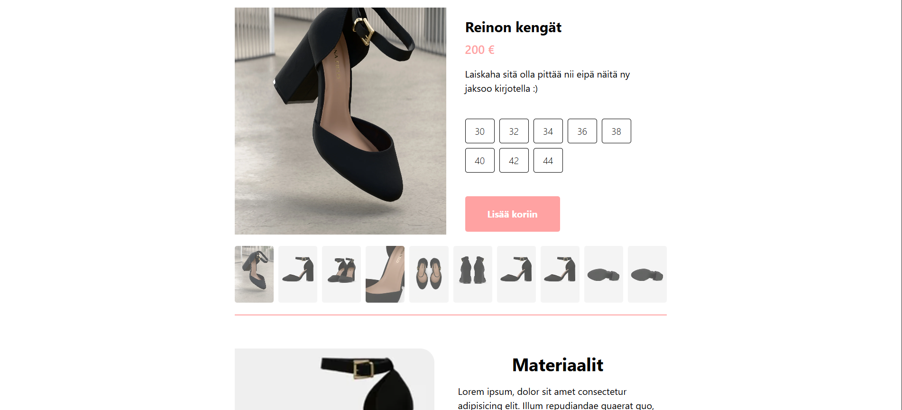

# 🏬 STOREPAGE — MERN Stack E-Commerce App (Inprogress)

> A full-stack eCommerce application demonstrating **API design** and **UI engineering** using the **MERN** stack (MongoDB, Express, React, Node.js).

## ⚙️ Project Overview

This project is API-driven fullstack web application. The core objective is **learning to establish a robust backend** for product data management trough a **RESTful API** and using a lightweight **React** frontend to quickly load the content.

### Tech Stack

**Backend** Node.js, Express.js
**Database** MongoDB (Mongoose)
**Frontend** React (Vite), JavaScript
**Styling** CSS / Tailwind
